# Taller de Entrenamiento de Modelo de Visión Computacional en AWS Rekognition

## Introducción

Este taller guía a los participantes a través del proceso de entrenamiento de un modelo de visión computacional utilizando Amazon Rekognition en AWS. El modelo se entrenará para clasificar imágenes de tornillos como "OK" o "con error", demostrando la potencia y facilidad de uso de las herramientas de aprendizaje automático en la nube.

Amazon Rekognition es un servicio de AWS que simplifica la incorporación de análisis de imágenes y videos en aplicaciones. Proporciona capacidades de aprendizaje profundo pre-entrenadas y personalizables, permitiendo a los desarrolladores agregar inteligencia visual a sus aplicaciones sin necesidad de experiencia previa en aprendizaje automático.

## Redes Convolucionales en Visión Computacional

El modelo que entrenaremos utiliza redes neuronales convolucionales (CNN), una clase de redes neuronales profundas comúnmente aplicadas a imágenes. Las CNN son particularmente efectivas en tareas de visión computacional debido a su capacidad para aprender automáticamente características jerárquicas de las imágenes.

Características clave de las CNN:

1.  **Capas Convolucionales**: Extraen características locales de la imagen.
2.  **Pooling**: Reduce la dimensionalidad espacial de las características extraídas.
3.  **Activación No Lineal**: Introduce no linealidad en el modelo, permitiendo aprender patrones complejos.
4.  **Capas Completamente Conectadas**: Combinan las características para la clasificación final.

En nuestro caso, la CNN aprenderá a distinguir entre tornillos normales y defectuosos basándose en patrones visuales en las imágenes de entrenamiento.

## Tabla de Contenidos

1.  [Preparación del Entorno](#1-preparaci%C3%B3n-del-entorno)
2.  [Creación del Proyecto en Amazon Rekognition](#2-creaci%C3%B3n-del-proyecto-en-amazon-rekognition)
3.  [Importación del Dataset](#3-importaci%C3%B3n-del-dataset)
4.  [Configuración de Permisos](#4-configuraci%C3%B3n-de-permisos)
5.  [Entrenamiento del Modelo](#5-entrenamiento-del-modelo)
6.  [Inicio del Modelo](#6-inicio-del-modelo)
7.  [Uso del Modelo](#7-uso-del-modelo)

## Pasos del Taller

### 1. Preparación del Entorno

1.  Cree un bucket en Amazon S3 con el nombre "datasetsjac".
    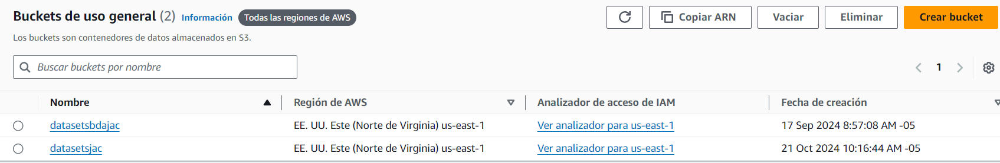
2.  Cargue el "Dataset_Tornillos" al bucket creado.
    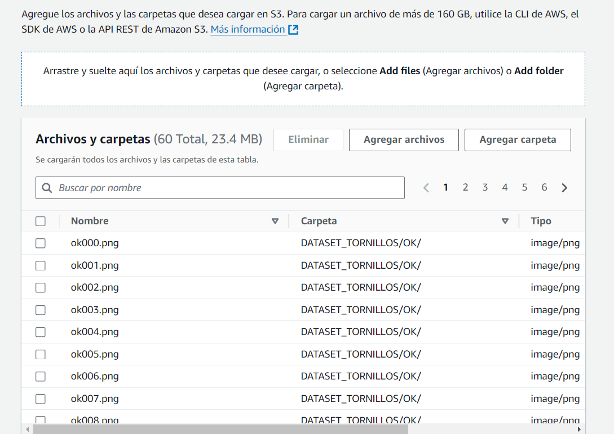

### 2. Creación del Proyecto en Amazon Rekognition

1.  Acceda al servicio de Amazon Rekognition en la consola de AWS, damos click en custom label y luego Get started.
    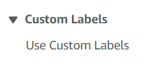
    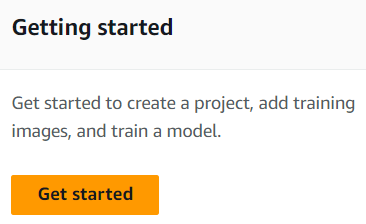
2.  La primera vez que use el servicio, se creará un bucket especial para almacenar los proyectos. Haga clic en "Create S3 bucket".
    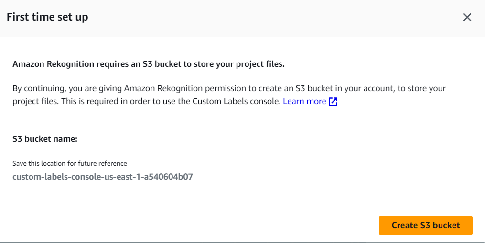
3.  Haga clic en "Create project".
    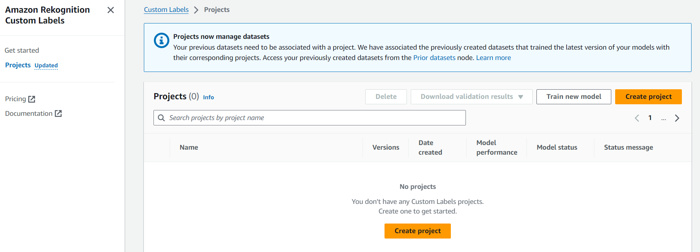
4.  Nombre el proyecto "modelo_visual_jac" y haga clic en "Crear proyecto".
    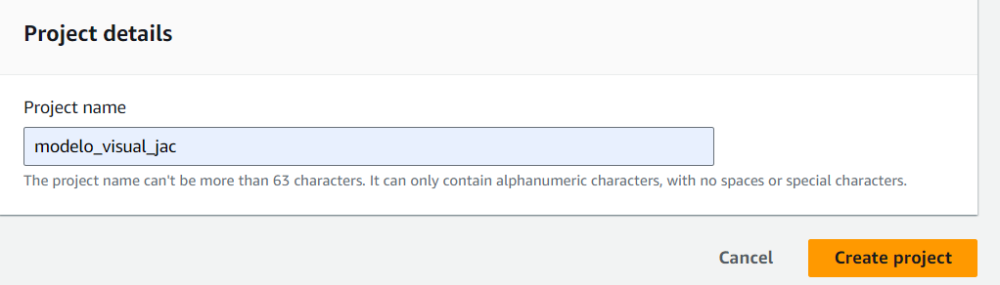

### 3. Importación del Dataset

1.  En el proyecto creado, haga clic en "Create dataset".
    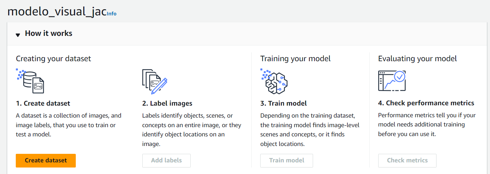
2.  En "Opciones de configuración", seleccione "Start with a single dataset".
    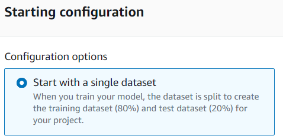
3.  En "Import training images", seleccione "Import images from S3 bucket".
    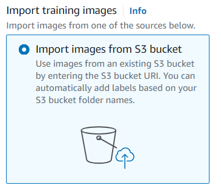
4.  En "URI de S3", ingrese la URI del bucket donde cargó el Dataset_Tornillos.
    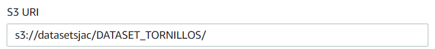
5.  Active la casilla de "Etiquetado automático".
    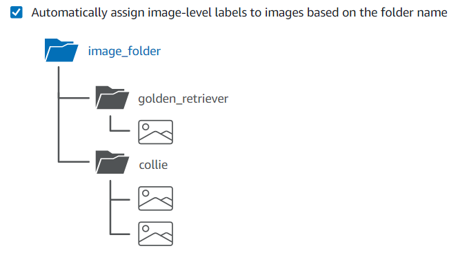

### 4. Configuración de Permisos

1.  Copie la cadena de permisos proporcionada por Amazon Rekognition.
    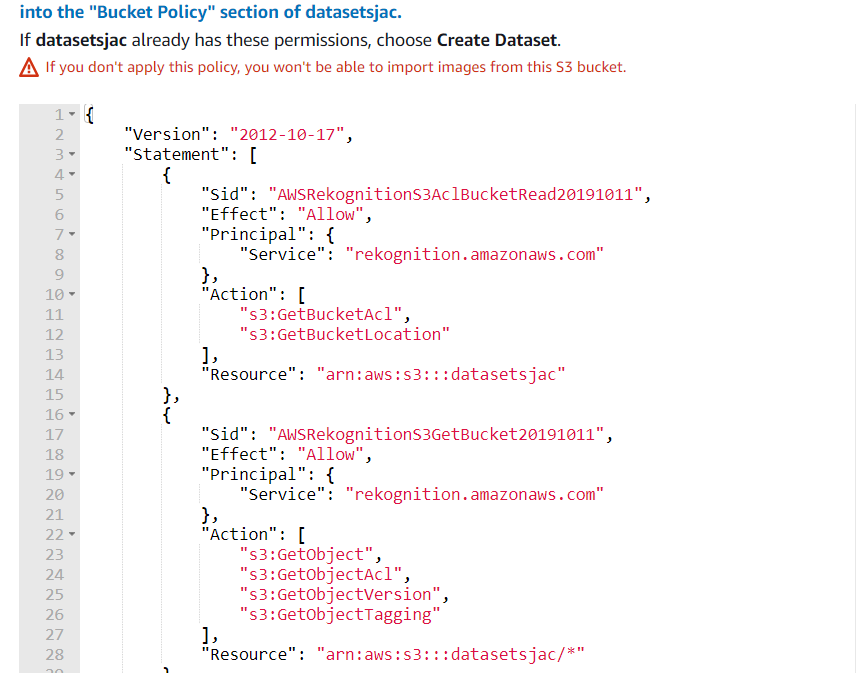
2.  En otra pestaña, busque el servicio S3 y acceda al bucket creado.
3.  Vaya a la sección de permisos y edite "Bucket policy".
    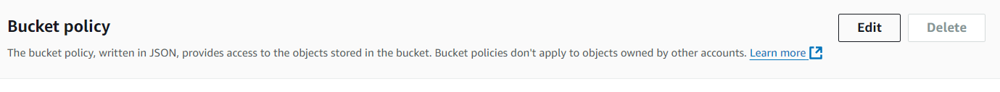
4.  Pegue la cadena de permisos en la política y guarde los cambios.
    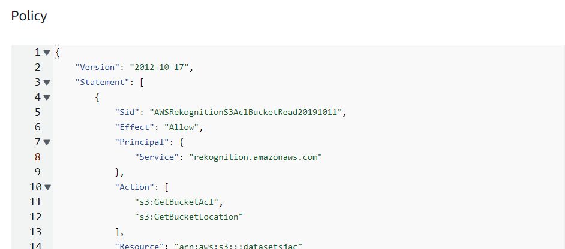

### 5. Entrenamiento del Modelo

1.  Vuelva a la pestaña del modelo en Amazon Rekognition.
2.  Haga clic en "Create Dataset".
    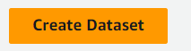
3.  Seleccione "Train model" y elija "modelo_visual_jac".
    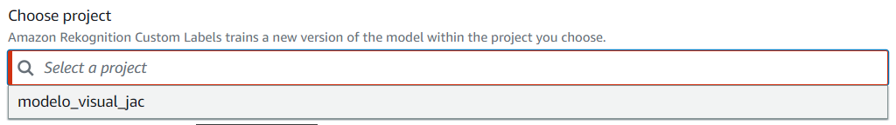
4.  Inicie el entrenamiento haciendo clic en "Train model".
    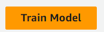

Nota: El tiempo estimado de entrenamiento es de aproximadamente 30 minutos.
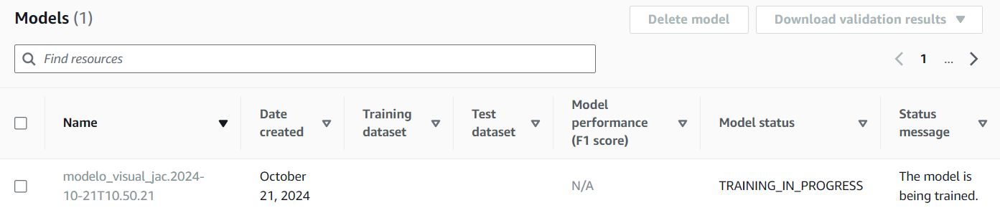

### 6. Inicio del Modelo

1. En Amazon Rekognition, vaya a la sección "Etiquetas personalizadas" y seleccione "Use Custom Labels".
2. Haga clic en la opción "Projects".
   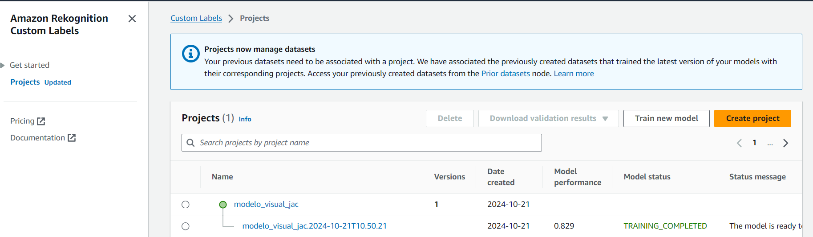
3. Seleccione el proyecto "modelo_visual_bda_jac".
   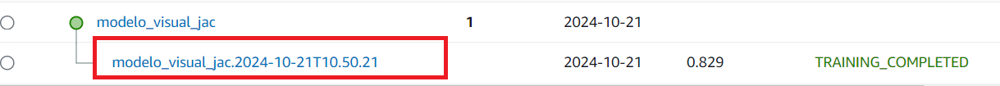
4. En la pestaña "Use model", haga clic en "Iniciar".
   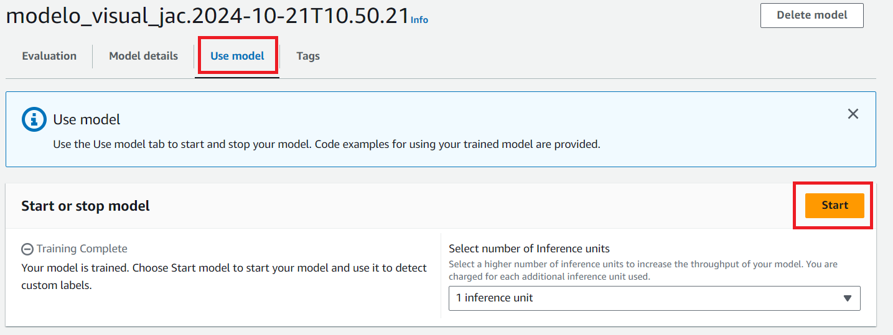
   Nota: El tiempo estimado para iniciar el modelo es de aproximadamente 30 minutos.

5. Para conectarse al modelo, necesitará su nombre. Desde la sección "Use your model", copie el nombre del modelo.## Conclusión
   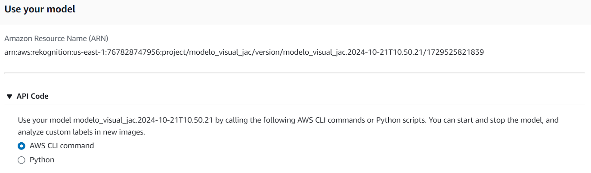

   Al completar este taller, habrá creado y entrenado un modelo de visión computacional capaz de clasificar imágenes de tornillos. Este proceso demuestra cómo AWS Rekognition simplifica el desarrollo y despliegue de soluciones de visión por computadora, permitiendo a los desarrolladores aprovechar el poder del aprendizaje profundo sin necesidad de experiencia previa en el campo.

### 7. Uso del Modelo

Para aprender cómo utilizar el modelo entrenado, consulte el notebook [Uso_Del_Modelo_Visual.ipynb](Uso_Del_Modelo_Visual.ipynb). Este notebook proporciona ejemplos detallados y código para interactuar con el modelo de visión computacional que ha entrenado.

## Conclusión

Al completar este taller, habrá creado, entrenado e iniciado un modelo de visión computacional capaz de clasificar imágenes de tornillos. Este proceso demuestra cómo AWS Rekognition simplifica el desarrollo y despliegue de soluciones de visión por computadora, permitiendo a los desarrolladores aprovechar el poder del aprendizaje profundo sin necesidad de experiencia previa en el campo.

Es importante resaltar que, una vez que haya terminado de usar el modelo, debe asegurarse de detenerlo y eliminarlo para evitar incurrir en costos innecesarios. AWS cobra por el tiempo que el modelo está desplegado y en ejecución, incluso si no se está utilizando activamente. Siga estos pasos para eliminar el modelo de manera segura:

1.  Vaya a la consola de Amazon Rekognition.
2.  Navegue hasta su proyecto y modelo.
3.  Detenga el modelo si está en ejecución.
4.  Elimine el modelo y, si ya no lo necesita, también el proyecto.
5.  Considere eliminar los datasets y buckets de S3 asociados si ya no los necesita.

Siguiendo estas prácticas de limpieza, podrá experimentar con AWS Rekognition de manera efectiva y económica, asegurándose de que solo paga por los recursos que realmente necesita y utiliza.

## Autores

Este taller fue desarrollado por:

- Jeysson Aly Contreras
  - LinkedIn: [https://www.linkedin.com/in/jeysson-aly-contreras/](https://www.linkedin.com/in/jeysson-aly-contreras/)
  - GitHub: [https://github.com/alyconr](https://github.com/alyconr)

Si tienes preguntas sobre este taller o estás interesado en colaborar en proyectos similares, no dudes en conectarte a través de LinkedIn o revisar mis proyectos en GitHub.
